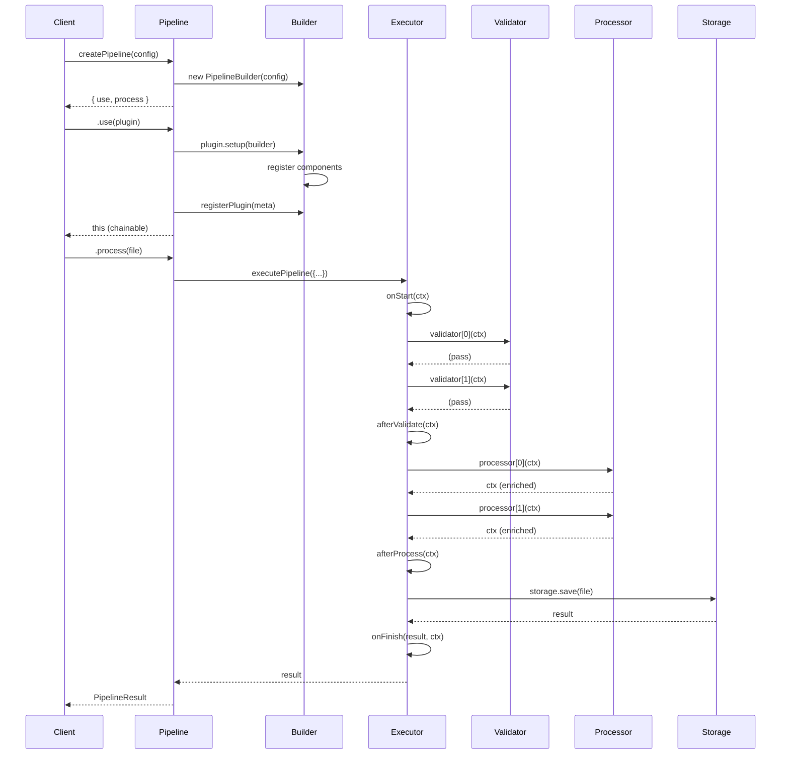

# Request Lifecycle

This document traces the complete lifecycle of a single file through the pipeline, from creation to storage.

---

## Lifecycle Stages



---

## Stage 1: Pipeline Creation

### 1.1 Factory Invocation
```typescript
const pipeline = createPipeline({
    storage: localStorage('./uploads'),
    validators: [maxSize(5 * 1024 * 1024)],
    processors: [imageProcessor],
    hooks: { onFinish: logResult }
});
```

### 1.2 Builder Initialization
- `PipelineBuilder` instantiated with config
- Validators, processors, hooks copied from config
- Storage assigned
- Empty `meta` initialized

### 1.3 Return Value
```typescript
// Returns object with chainable API
{
    use(plugin): this,
    process(file): Promise<PipelineResult>
}
```

---

## Stage 2: Plugin Registration

### 2.1 Using a Plugin
```typescript
pipeline.use(myPlugin);
```

### 2.2 Plugin Setup Execution
```typescript
// Inside createPipeline().use()
if (isPipelinePlugin(plugin)) {
    plugin.setup(builder);  // Register components
    registerPlugin({ name, version });  // Track metadata
} else if (typeof plugin === 'function') {
    plugin(builder);  // Function form
    registerPlugin({ name: plugin.name });
}
```

### 2.3 Hook Merging
When multiple plugins register hooks:
```typescript
// builder.mergeHooks() chains them
onStart: async (ctx) => {
    await existingHook(ctx);
    await incomingHook(ctx);
}
```

---

## Stage 3: File Processing

### 3.1 Process Invocation
```typescript
const result = await pipeline.process({
    buffer: Buffer.from('...'),
    filename: 'image.jpg',
    mimeType: 'image/jpeg',
    size: 1024
});
```

### 3.2 Context Initialization
```typescript
const ctx = {
    file: inputFile,
    metadata: {},
    meta: {
        plugins: [],    // From builder
        trace: []       // Empty, will be populated
    }
};
```

### 3.3 Executor Pipeline

#### Step 3.3.1: onStart Hook
```typescript
await hooks.onStart?.(ctx);
trace(ctx, { plugin: "core", stage: "hook", message: "onStart executed" });
```

#### Step 3.3.2: Validation Phase
```typescript
for (const validator of validators) {
    await validator(ctx);  // Throws on failure
    trace(ctx, { 
        plugin: validator.name, 
        stage: "validator", 
        message: "validation passed",
        duration: ms 
    });
}
await hooks.afterValidate?.(ctx);
```

#### Step 3.3.3: Processing Phase
```typescript
for (const processor of processors) {
    ctx = await processor(ctx);  // Context enriched
    trace(ctx, { 
        plugin: processor.name, 
        stage: "processor", 
        message: "processed",
        duration: ms 
    });
}
await hooks.afterProcess?.(ctx);
```

#### Step 3.3.4: Storage Phase
```typescript
const result = await storage.save(ctx.file);
trace(ctx, { 
    plugin: "storage", 
    stage: "storage", 
    message: "file saved",
    duration: ms 
});
```

#### Step 3.3.5: onFinish Hook
```typescript
await hooks.onFinish?.(result, ctx);
trace(ctx, { plugin: "core", stage: "hook", message: "onFinish executed" });

return { ...result, metadata: ctx.metadata, meta: ctx.meta };
```

---

## Stage 4: Error Handling

### 4.1 Error Flow
```typescript
try {
    // ... pipeline stages ...
} catch (err) {
    await hooks.onError?.(error, ctx);
    trace(ctx, { plugin: "core", stage: "hook", message: "onError executed" });
    throw err;  // Re-throw after hooks
}
```

### 4.2 Error Types
| Error Type | Thrown By | Code |
|------------|-----------|------|
| `ValidationError` | Validators | `VALIDATION_ERROR` |
| `ProcessorError` | Processors | `PROCESSOR_ERROR` |
| `StorageError` | Storage | `STORAGE_ERROR` |
| `PipelineError` | General | `UNKNOWN_ERROR` |

---

## Stage 5: Result Return

### 5.1 Result Structure
```typescript
{
    url: "/uploads/image.jpg",      // Storage location
    path: "/uploads/image.jpg",     // File path
    size: 1024,                     // File size
    metadata: { step1: true },      // From processors
    meta: {
        plugins: [{ name: "my-plugin", version: "1.0.0" }],
        trace: [
            { plugin: "core", stage: "hook", message: "onStart executed", timestamp: ... },
            { plugin: "maxSize", stage: "validator", message: "validation passed", duration: 1 },
            // ... more trace events
        ]
    }
}
```

---

## Lifecycle Summary

| Phase | Action | Key Operations |
|-------|--------|----------------|
| **Creation** | `createPipeline()` | Builder instantiation |
| **Configuration** | `.use(plugin)` | Component registration, hook merging |
| **Processing** | `.process(file)` | Context creation, executor run |
| **Validation** | Executor | Sequential validators, fail-fast |
| **Processing** | Executor | Sequential processors, context enrichment |
| **Storage** | Executor | Single save operation |
| **Completion** | Executor | Result enrichment, onFinish hook |
| **Error** | Executor | onError hook, exception propagation |